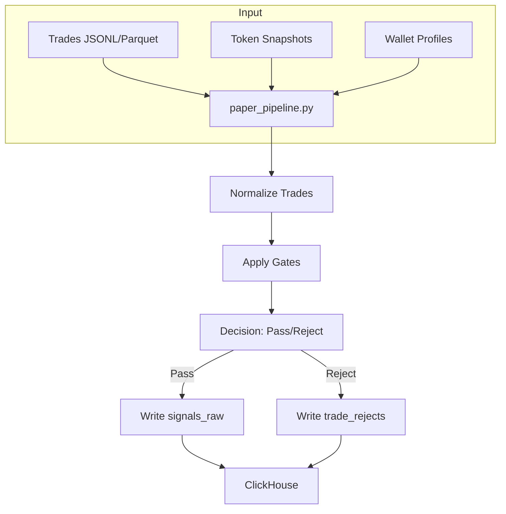

# Strategy Pack — Project Overview

## Quick Summary

**Strategy Pack** — это Python-проект для автоматизированной торговой стратегии (迭代-1). Система обрабатывает торговые события, применяет правила gates, и генерирует сигналы для execution. Работает с ClickHouse как основной БД.

## Архитектура



## Ключевые модули

| Directory | Назначение | Тип |
|-----------|-----------|-----|
| `integration/` | Glue code: pipeline, CH client, schema validation | Python |
| `strategy/` | Конфигурация стратегии, risk engine | Python + YAML |
| `execution/` | Модели исполнения, latency simulation | Python |
| `features/` | Trade features computation | Python |
| `ingestion/` | Нормализация входных данных | Python |
| `policy/` | Agent policy rules | YAML |

## Основные файлы

### Integration Layer

- **[`integration/paper_pipeline.py`](integration/paper_pipeline.py)** — Главный пайплайн (P0.1). Trades → snapshot → gates → signals
- **[`integration/ch_client.py`](integration/ch_client.py)** — ClickHouse connection singleton
- **[`integration/trade_normalizer.py`](integration/trade_normalizer.py)** — Normalization JSONL/Parquet → Trade objects
- **[`integration/gates.py`](integration/gates.py)** — Hard gates для фильтрации trades
- **[`integration/mode_registry.py`](integration/mode_registry.py)** — Mode bucket resolution
- **[`integration/wallet_tier_registry.py`](integration/wallet_tier_registry.py)** — Wallet tier classification

### Strategy Layer

- **[`strategy/risk_engine.py`](strategy/risk_engine.py)** — Position sizing + kill-switch
- **[`strategy/strategy.yaml`](strategy/strategy.yaml)** — Main strategy config
- **[`strategy/config/params_base.yaml`](strategy/config/params_base.yaml)** — Runtime parameters
- **[`strategy/wallet_allowlist.yaml`](strategy/wallet_allowlist.yaml)** — Allowed wallets

### Data Flow

```
1. Load config (params_base.yaml)
2. Load allowlist + token snapshots
3. For each trade:
   a. Normalize → Trade object
   b. Enrich with wallet profiles
   c. Apply gates (token quality, wallet tier, etc.)
   d. If pass → insert into signals_raw
   e. If reject → insert into trade_rejects
4. Emit forensics events (config_version, allowlist_version)
```

## Gate Types

| Gate | Description |
|------|-------------|
| `token_quality_gate` | Liquidity, volume, spread thresholds |
| `wallet_tier_gate` | Minimum tier requirement |
| `mode_allowlist` | Mode-specific rules |
| `sim_preflight` | Deterministic simulation metrics |

## ClickHouse Tables

- `forensics_events` — meta events (config_version, allowlist_version)
- `signals_raw` — generated trading signals
- `trade_rejects` — rejected trades with reasons

## Config Files

| File | Purpose |
|------|---------|
| `strategy/config/modes.yaml` | Mode definitions |
| `strategy/config/params_base.yaml` | Base parameters |
| `strategy/wallet_allowlist.yaml` | Wallet allowlist |

## Key Concepts

### Mode Buckets
Trades bucketed by mode for metrics: `U` (unclassified), explicit modes, or `__unknown_mode__`

### Wallet Tiers
Classification based on wallet profiles: `tier_n`, `tier_1`, etc.

### Sim Preflight
Deterministic simulation attached to summary JSON output (optional flag)

## Quick Commands

```bash
# Run smoke tests
./scripts/smoke.sh

# Paper pipeline demo
python3 -m integration.paper_pipeline --dry-run --trades-jsonl integration/fixtures/trades.sample.jsonl

# Generate runtime config
python3 -m integration.config_mapper

# Run exit plan demo
python3 -m integration.run_exit_plan --seed-golden
```

## Sources of Truth

1. **CANON (vendor/gmee_canon)** — read-only, v23
2. **integration/** — mutable glue code
3. **scripts/** — CI/CD scripts

## Forbidden Patterns

- ❌ Modifying CANON SQL/DDL
- ❌ "Second canon" logic in Python
- ❌ Exit math outside CANON queries

## Next Steps

- Explore specific modules in detail
- Review integration tests
- Add new gate types
- Extend feature engineering
