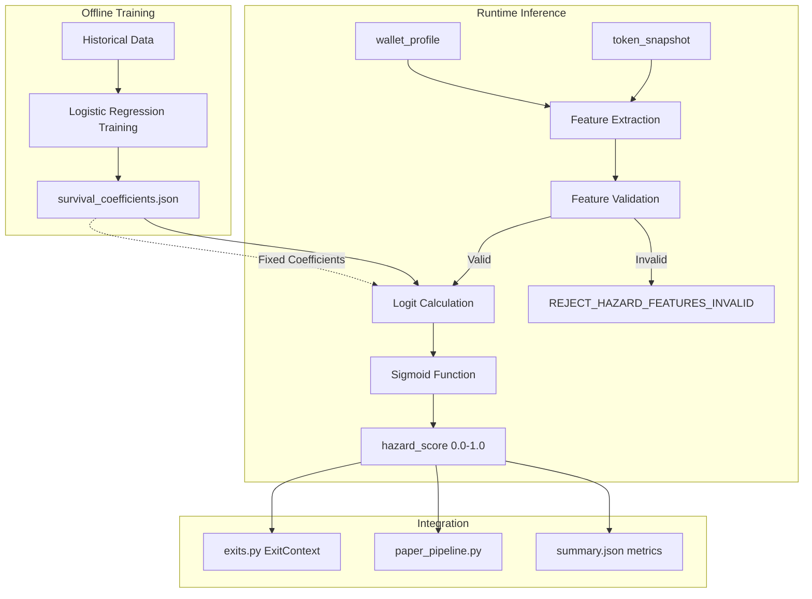

# PR-Z.4 — Exit Hazard Prediction Model Implementation Plan

## Status Analysis

### Already Implemented ✅
| Component | File | Status |
|-----------|------|--------|
| Core prediction logic | [`strategy/survival_model.py`](strategy/survival_model.py) | Complete |
| Pipeline stage | [`integration/hazard_stage.py`](integration/hazard_stage.py) | Complete |
| Stage config/metrics | [`integration/hazard_stage.py`](integration/hazard_stage.py:41-76) | Complete |
| Feature extraction | [`integration/hazard_stage.py`](integration/hazard_stage.py:78-138) | Complete |
| CLI argument parsing | [`integration/hazard_stage.py`](integration/hazard_stage.py:207-233) | Complete |
| Built-in smoke test | [`integration/hazard_stage.py`](integration/hazard_stage.py:237-352) | Complete |

### Missing Components ❌
| Component | File | Description |
|-----------|------|-------------|
| Coefficients file | `strategy/survival_coefficients.json` | Fixed model coefficients |
| Reject reason | `integration/reject_reasons.py` | `REJECT_HAZARD_FEATURES_INVALID` |
| Runtime config | `config/runtime_schema.py` | `hazard_threshold` field |
| Test fixtures | `integration/fixtures/hazard/` | Test data files |
| Smoke script | `scripts/hazard_smoke.sh` | Standalone smoke test |
| Documentation | `strategy/docs/overlay/PR_HAZARD_MODEL.md` | Feature specification |
| Pipeline integration | `integration/paper_pipeline.py` | Wire hazard_stage |
| Exit context | `strategy/exits.py` | Add `hazard_score` field |

---

## Implementation Tasks

### Task 1: Create Coefficients File
**File:** `strategy/survival_coefficients.json`

```json
{
    "beta0": -1.2,
    "beta1": 0.35,
    "beta2": 0.8,
    "beta3": 0.04,
    "beta4": 0.0015
}
```

### Task 2: Add Reject Reason
**File:** `integration/reject_reasons.py`

Add after line 140 (after coordination reasons):
```python
# PR-Z.4: Hazard Model Feature Validation
REJECT_HAZARD_FEATURES_INVALID = "REJECT_HAZARD_FEATURES_INVALID"
```

### Task 3: Add Runtime Config Field
**File:** `config/runtime_schema.py`

Add to `RuntimeConfig` dataclass after `coordination_threshold`:
```python
# Exit Hazard Prediction (PR-Z.4)
hazard_threshold: float = 0.35  # Threshold for aggressive exit trigger
```

Add validation in `__post_init__`:
```python
# Hazard Model
self._validate_range("hazard_threshold", self.hazard_threshold, 0.1, 0.7)
```

### Task 4: Create Test Fixtures
**Directory:** `integration/fixtures/hazard/`

#### 4.1 `features_sample.jsonl`
```jsonl
{"id": "1", "volume_spike_15s_z": 0.5, "smart_money_exits_30s": 1, "liquidity_drain_60s_pct": -5.0, "price_impact_15s_bps": 100}
{"id": "2", "volume_spike_15s_z": 3.0, "smart_money_exits_30s": 5, "liquidity_drain_60s_pct": -25.0, "price_impact_15s_bps": 800}
{"id": "3", "volume_spike_15s_z": 1.5, "smart_money_exits_30s": 2, "liquidity_drain_60s_pct": -10.0, "price_impact_15s_bps": 300}
{"id": "4", "volume_spike_15s_z": 10.0, "smart_money_exits_30s": 0, "liquidity_drain_60s_pct": 0.0, "price_impact_15s_bps": 0}
{"id": "5", "volume_spike_15s_z": 0.0, "smart_money_exits_30s": 0, "liquidity_drain_60s_pct": -60.0, "price_impact_15s_bps": 0}
```

#### 4.2 `expected_hazard_scores.jsonl`
```jsonl
{"id": "1", "expected_hazard_min": 0.10, "expected_hazard_max": 0.20}
{"id": "2", "expected_hazard_min": 0.60, "expected_hazard_max": 0.75}
{"id": "3", "expected_hazard_min": 0.25, "expected_hazard_max": 0.45}
```

#### 4.3 `coefficients_fixed.json`
```json
{
    "beta0": -1.2,
    "beta1": 0.35,
    "beta2": 0.8,
    "beta3": 0.04,
    "beta4": 0.0015
}
```

### Task 5: Create Smoke Test Script
**File:** `scripts/hazard_smoke.sh`

```bash
#!/bin/bash
# scripts/hazard_smoke.sh
# PR-Z.4 Hazard Model Smoke Test

set -e

echo "[overlay_lint] running hazard smoke..."

cd "$(dirname "$0")/.."

# Run the built-in smoke test from hazard_stage.py
python3 -m integration.hazard_stage

# Additional validation with fixtures
if [ -f "integration/fixtures/hazard/features_sample.jsonl" ]; then
    echo "[hazard_smoke] Running fixture validation..."
    
    # Run pipeline with hazard model enabled
    python3 -m integration.paper_pipeline \
        --enable-hazard-model \
        --hazard-threshold 0.35 \
        --input integration/fixtures/hazard/features_sample.jsonl \
        --summary-json 2>/dev/null | head -1 > /tmp/hazard_summary.json
    
    # Validate output
    if [ -f /tmp/hazard_summary.json ]; then
        avg=$(jq -r '.hazard_score_avg // empty' /tmp/hazard_summary.json 2>/dev/null || echo "")
        if [ -n "$avg" ]; then
            echo "[hazard_smoke] hazard_score_avg=$avg"
        fi
    fi
fi

echo "[hazard_smoke] OK ✅"
```

### Task 6: Create Documentation
**File:** `strategy/docs/overlay/PR_HAZARD_MODEL.md`

Sections to include:
1. Overview and goal
2. Feature specification with ranges
3. Formula (logistic regression)
4. Integration points
5. CLI flags
6. Example usage
7. DoD checklist

### Task 7: Integrate into Paper Pipeline
**File:** `integration/paper_pipeline.py`

Changes needed:
1. Import hazard stage components
2. Add `--enable-hazard-model` CLI argument
3. Call `run_hazard_stage()` after feature wiring
4. Include hazard metrics in summary output

### Task 8: Add hazard_score to ExitContext
**File:** `strategy/exits.py`

Add optional `hazard_score` field to `PositionState` or create new `ExitContext` dataclass:
```python
@dataclass(frozen=True)
class ExitContext:
    """Extended context for exit decisions including hazard score."""
    position: PositionState
    hazard_score: float = 0.0
    hazard_enabled: bool = False
```

---

## Grep Points Verification

| Grep Command | Expected Location |
|--------------|-------------------|
| `grep -n "def predict_exit_hazard" strategy/survival_model.py` | Line 136 |
| `grep -n "survival_coefficients.json" strategy/survival_model.py` | Line 62 |
| `grep -n "hazard_score_avg" integration/hazard_stage.py` | Line 72 |
| `grep -n "REJECT_HAZARD_FEATURES_INVALID" integration/reject_reasons.py` | TBD (new) |
| `grep -n "PR-Z.4" strategy/docs/overlay/PR_HAZARD_MODEL.md` | TBD (new) |
| `grep -n "\[hazard_smoke\] OK" scripts/hazard_smoke.sh` | TBD (new) |

---

## DoD Checklist

- [ ] `bash scripts/hazard_smoke.sh` → exit 0, stderr contains `[hazard_smoke] OK`
- [ ] Without `--enable-hazard-model` flag, pipeline works as before
- [ ] Feature out of range → entry in `rejects.jsonl` with `REJECT_HAZARD_FEATURES_INVALID`
- [ ] `jq '.hazard_score_avg' summary.json` returns value in [0.0, 1.0]
- [ ] All new code lines contain `hazard` reference
- [ ] No changes in `vendor/gmee_canon/`
- [ ] Coefficients loaded from file, not generated at runtime

---

## Architecture Diagram



---

## Feature Ranges Reference

| Feature | Min | Max | Description |
|---------|-----|-----|-------------|
| `volume_spike_15s_z` | -3.0 | +5.0 | Z-score of 15s volume vs 5m average |
| `smart_money_exits_30s` | 0 | 10 | Count of Tier-1 wallet exits in 30s |
| `liquidity_drain_60s_pct` | -50.0 | +10.0 | Pool liquidity change % over 60s |
| `price_impact_15s_bps` | -500 | +2000 | Price impact in basis points over 15s |

---

## Coefficient Interpretation

| Coefficient | Value | Effect |
|-------------|-------|--------|
| β0 (intercept) | -1.2 | Base hazard ~23% when all features = 0 |
| β1 (volume spike) | 0.35 | Each +1 z-score increases logit by 0.35 |
| β2 (smart money exits) | 0.8 | Each exit increases logit by 0.8 |
| β3 (liquidity drain) | 0.04 | Each -1% drain increases logit by 0.04 |
| β4 (price impact) | 0.0015 | Each +100 bps increases logit by 0.15 |
